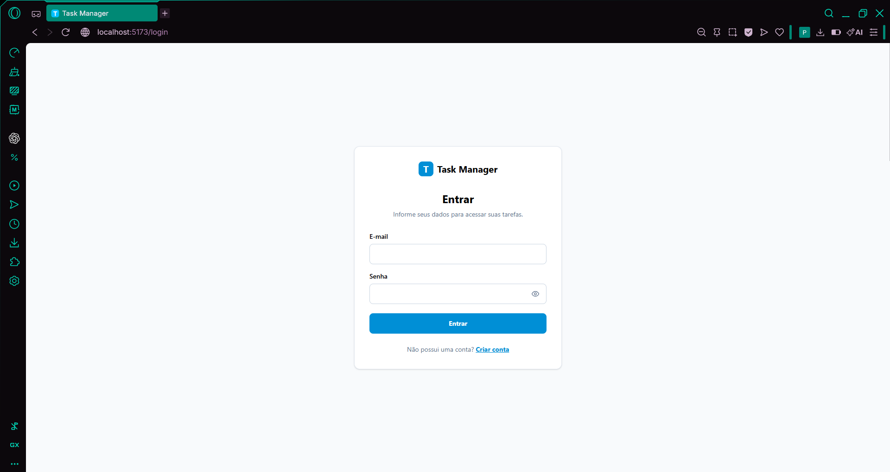
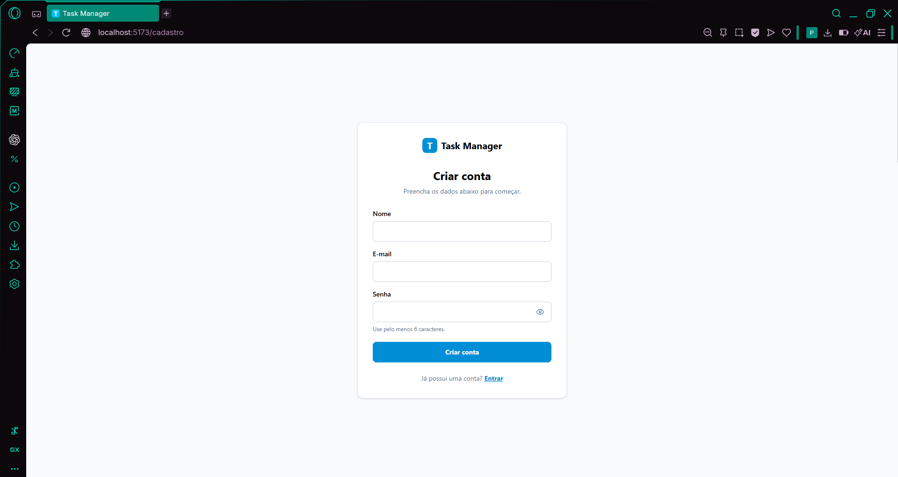
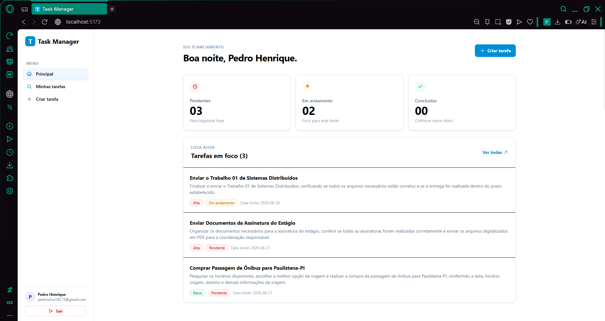
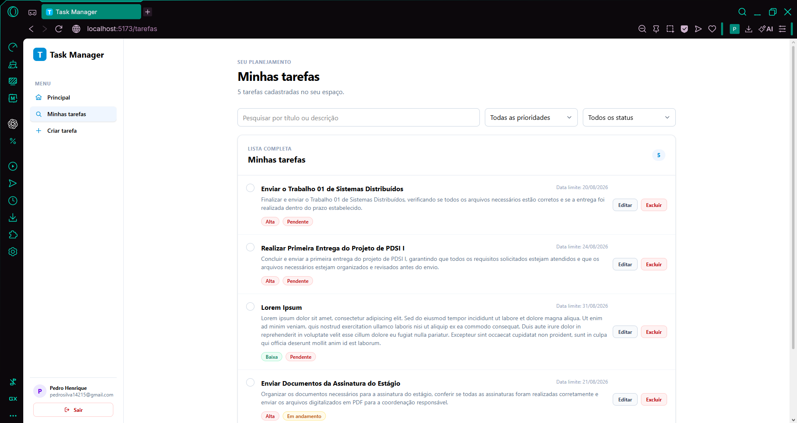
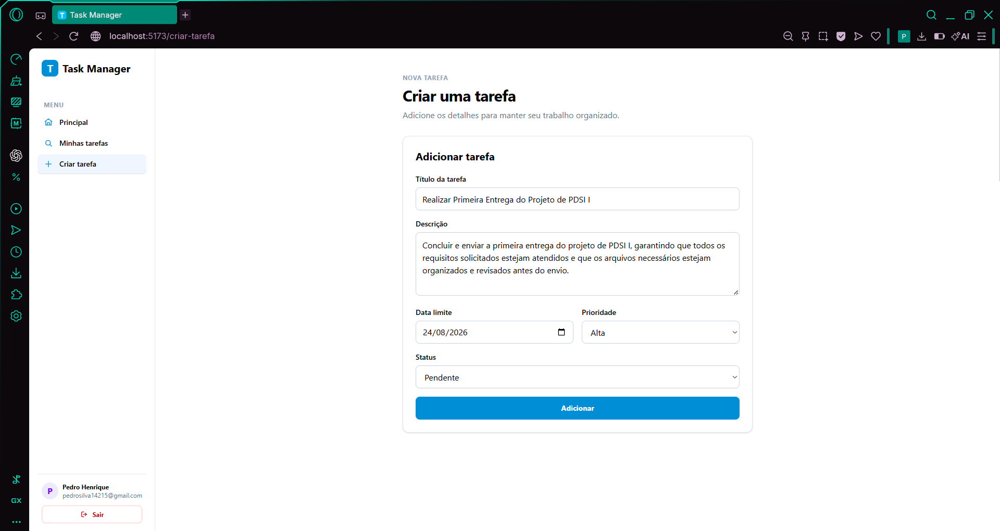
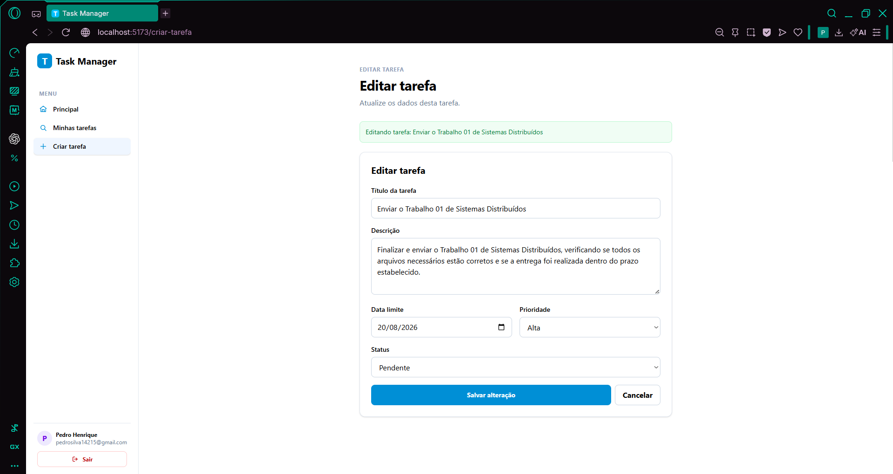

# Gerenciador de Tarefas — Trabalho 01 (SD)

Sistema de gerenciamento de tarefas com autenticação, permitindo criar, listar, editar e excluir tarefas de forma organizada. Desenvolvido como projeto acadêmico da disciplina de Sistemas Distribuídos.

       

---

## Sumário

- [Instruções de Instalação e Execução](#instruções-de-instalação-e-execução)
- [Prints da Interface](#prints-da-interface)
- [Estrutura do Código](#estrutura-do-código)
- [Arquitetura do Projeto](#arquitetura-do-projeto)
- [Testes](#testes)
- [Licença](#licença)

---

## Instruções de Instalação e Execução

### Pré-requisitos

- [Node.js](https://nodejs.org/) ≥ 18
- [Python](https://www.python.org/) ≥ 3.12
- Conta no [Supabase](https://supabase.com/) (projeto com URL e chave publishable)

### 1. Clonar o repositório

```bash
git clone https://github.com/phsrod/Trabalho01-SDMaster.git
cd Trabalho01-SDMaster
```

### 2. Configurar variáveis de ambiente

Copie o `.env.example` para `.env` na raiz do projeto e preencha com suas credenciais:

```bash
cp .env.example .env
```

Edite o `.env`:

```env
VITE_SUPABASE_URL=https://seu-projeto.supabase.co
VITE_SUPABASE_PUBLISHABLE_KEY=sua-chave-aqui
VITE_API_URL=http://localhost:8000
```

### 3. Instalar e rodar o Backend

```bash
cd server

# Criar e ativar ambiente virtual
python -m venv .venv
source .venv/bin/activate   # Linux/Mac
# .venv\Scripts\activate    # Windows

# Instalar dependências
pip install -r requirements.txt

# Iniciar o servidor (porta 8000)
uvicorn main:app --reload
```

### 4. Instalar e rodar o Frontend

```bash
cd client

# Instalar dependências
npm install

# Iniciar o servidor de desenvolvimento (porta 5173)
npm run dev
```

### 5. Acessar a aplicação

Acesse [http://localhost:5173](http://localhost:5173) no navegador.

---

## Prints da Interface

### Login



### Cadastro



### Página Inicial



### Lista de Tarefas



### Criar Tarefa



### Editar Tarefa




---

## Estrutura do Código

```
.
├── .env                        # Variáveis de ambiente (não versionado)
├── .env.example                # Template de variáveis de ambiente
├── .gitignore
├── LICENSE
├── README.md
│
├── .github/
│   └── screenshots/            # Prints das interfaces
│       ├── login.png
│       ├── cadastro.png
│       ├── home.png
│       ├── tarefas.png
│       ├── criar_tarefa.png
│       └── editar_tarefa.png
│
├── client/                     # ── Frontend (React + Vite) ────────────
│   ├── index.html
│   ├── package.json
│   ├── package-lock.json
│   ├── vite.config.js
│   ├── eslint.config.js
│   ├── public/
│   └── src/
│       ├── main.jsx              # Entry point
│       ├── App.jsx               # Componente raiz
│       ├── api.js                # Chamadas HTTP ao backend
│       ├── supabaseClient.js     # Cliente Supabase (front)
│       ├── constants.js          # Labels, estilos e mapeamentos
│       ├── index.css             # Estilos globais (Tailwind)
│       ├── router/
│       │   ├── AppRouter.jsx     # Rotas da aplicação
│       │   └── ProtectedLayout.jsx  # Guard de autenticação
│       ├── pages/
│       │   ├── LoginPage.jsx
│       │   ├── RegisterPage.jsx
│       │   ├── HomePage.jsx
│       │   ├── TasksPage.jsx
│       │   ├── CreateTaskPage.jsx
│       │   └── NotFoundPage.jsx
│       ├── components/
│       │   ├── common/           # Componentes reutilizáveis
│       │   │   ├── FeedbackAlert.jsx
│       │   │   └── Icon.jsx
│       │   ├── layout/           # Layouts de página
│       │   │   └── MainLayout.jsx
│       │   └── tasks/            # Componentes de tarefas
│       │       ├── TaskForm.jsx
│       │       └── TaskList.jsx
│       └── context/
│           ├── TaskContext.jsx   # Provider global de tarefas
│           ├── taskContext.js    # Criação do Context
│           └── useTaskContext.js # Hook de acesso ao contexto
│
└── server/                     # ── Backend (FastAPI) ─────────────────
    ├── main.py                   # Entrada do servidor
    ├── requirements.txt
    ├── app/
    │   ├── config.py             # Leitura de variáveis de ambiente
    │   ├── database.py           # Cliente Supabase (server)
    │   ├── models/
    │   │   └── task.py           # Pydantic models (TaskCreate, TaskUpdate)
    │   ├── routes/
    │   │   ├── auth.py           # GET /me
    │   │   └── tasks.py          # CRUD /tasks
    │   └── dependencies/
    │       └── auth.py           # Autenticação via Bearer token
    └── tests/
        ├── configtest.py         # Configuração de fixtures dos testes
        ├── test_auth.py          # Testes de autenticação
        ├── test_post.py          # Testes de criação de tarefa
        ├── test_get.py           # Testes de listagem de tarefas
        ├── test_put.py           # Testes de atualização de tarefa
        ├── test_delete.py        # Testes de exclusão de tarefa
        └── test_main.py          # Testes do endpoint principal
```

---

## Arquitetura do Projeto

O sistema segue uma arquitetura **client-server** com separação clara de responsabilidades. O frontend (React) é responsável pela interface do usuário e pelo estado da aplicação, enquanto o backend (FastAPI) processa as regras de negócio, valida dados e se comunica com o banco de dados.

### Visão Geral

```
┌─────────────────────────────────────────────────────────────────────┐
│                          USUÁRIO                                    │
│                     (Navegador Web)                                 │
└──────────────────────────┬──────────────────────────────────────────┘
                           │
                           ▼
┌───────────────────────────────────────────────────────────────────┐
│                       FRONTEND                                    │
│                React + Vite + Tailwind CSS                        │
│                                                                   │
│  ┌─────────────┐  ┌─────────────┐  ┌──────────────────────────┐   │
│  │   Páginas   │  │ Componentes │  │     Context API          │   │
│  │  (Router)   │──│  (UI)       │──│  (TaskContext)           │   │
│  └─────────────┘  └─────────────┘  └──────────────────────────┘   │
│         │                                │                        │
│         ▼                                ▼                        │
│  ┌─────────────┐                 ┌─────────────────┐              │
│  │   api.js    │                 │ supabaseClient  │              │
│  │ (HTTP calls)│                 │ (Auth SDK)      │              │
│  └──────┬──────┘                 └────────┬────────┘              │
└─────────┼─────────────────────────────────┼───────────────────────┘
          │  Bearer Token (JWT)             │  Supabase Auth (SDK)
          ▼                                 ▼
┌────────────────────────────────────────────────────────────────────┐
│                        BACKEND                                     │
│                     FastAPI (Python)                               │
│                                                                    │
│  ┌─────────────┐  ┌──────────────────┐  ┌──────────────────┐       │
│  │   Routes    │  │  Dependencies    │  │     Models       │       │
│  │ /tasks, /me │──│  auth.py         │──│  Pydantic        │       │
│  └─────────────┘  │  (validação JWT) │  │  (validação)     │       │
│                   └────────┬─────────┘  └──────────────────┘       │
│                            │                                       │
│                   ┌────────▼─────────┐                             │
│                   │    database.py   │                             │
│                   │  (Supabase SDK)  │                             │
│                   └────────┬─────────┘                             │
└────────────────────────────┼───────────────────────────────────────┘
                             │
                             ▼
┌─────────────────────────────────────────────────────────────────────┐
│                       BANCO DE DADOS                                │
│                    Supabase (PostgreSQL)                            │
│                                                                     │
│  ┌─────────────────────┐   ┌─────────────────────┐                  │
│  │     users           │   │      tasks          │                  │
│  │  (Supabase Auth)    │   │  (dados das tarefas)│                  │
│  └─────────────────────┘   └─────────────────────┘                  │
└─────────────────────────────────────────────────────────────────────┘
```

### Fluxo de Autenticação

```
┌──────────┐    1. Login/Registro    ┌───────────────┐    2. Token JWT   ┌────────┐
│ Frontend │ ──────────────────────▶│  Supabase     │ ────────────────▶ │  User  │
│ (React)  │ ◀──────────────────────│  Auth (SDK)   │ ◀──────────────── │        │
└─────┬────┘    3. access_token      └───────────────┘                   └────────┘
      │
      │  4. Requisições HTTP
      │     Authorization: Bearer <token>
      ▼
┌──────────────┐   5. Valida token    ┌───────────────┐   6. Query DB  ┌────────┐
│   Backend    │ ──────────────────▶ │  Supabase      │ ─────────────▶│Tasks DB│
│  (FastAPI)   │ ◀────────────────── │  (SDK auth)    │ ◀─────────────│        │
└──────────────┘   7. Dados retornados└───────────────┘                └────────┘
```

### Componentes Principais

| Camada | Componente | Responsabilidade |
|--------|-----------|-------------------|
| **Frontend** | `AppRouter` | Rotas da aplicação (React Router) |
| | `ProtectedLayout` | Guard de autenticação nas rotas protegidas |
| | `TaskContext` | Estado global das tarefas (React Context) |
| | `api.js` | Camada de comunicação HTTP com o backend |
| | `supabaseClient` | Cliente Supabase para autenticação no frontend |
| | `constants.js` | Labels, estilos e mapeamentos centralizados |
| **Backend** | `main.py` | Entrada do servidor FastAPI, configuração CORS |
| | `routes/auth.py` | Rota `GET /me` — retorna dados do usuário autenticado |
| | `routes/tasks.py` | CRUD completo: `POST`, `GET`, `PUT`, `DELETE` em `/tasks` |
| | `dependencies/auth.py` | Validação de JWT, extração de token, cliente autenticado |
| | `models/task.py` | Modelos Pydantic (`TaskCreate`, `TaskUpdate`) |
| | `database.py` | Inicialização do cliente Supabase |
| **Banco** | Supabase | Autenticação de usuários + banco PostgreSQL para tarefas |

### Fluxo de Dados

1. **Autenticação:** O usuário faz login/cadastro pelo Supabase Auth (SDK no frontend). O Supabase retorna um JWT.
2. **Requisições autenticadas:** O frontend envia o JWT no header `Authorization: Bearer` em todas as chamadas HTTP ao backend.
3. **Validação no backend:** O `dependencies/auth.py` extrai e valida o token, obtendo os dados do usuário via `supabase.auth.get_user()`.
4. **CRUD de tarefas:** O backend opera diretamente no banco PostgreSQL via SDK do Supabase, filtrando por `user_id` para isolar dados entre usuários.
5. **Resposta ao frontend:** Os dados são transformados (`toApiTask` / `fromApiTask`) para alinhar nomenclatura (snake_case ↔ camelCase) entre backend e frontend.

### Características da Arquitetura

| Item | Pergunta | Resposta |
|------|----------|----------|
| **Componentes** | Quais partes independentes existem? | Três componentes principais: o **frontend** (React + Vite), o **backend** (FastAPI) e o **banco de dados** (Supabase/PostgreSQL). Cada um pode ser desenvolvido e executado de forma independente. |
| **Compartilhamento** | O que é compartilhado? | O **banco de dados** é compartilhado entre backend e Supabase Auth. O **token JWT** é compartilhado entre frontend e backend para autenticação. As **constantes** de labels e estilos são compartilhadas internamente no frontend via `constants.js`. |
| **Tipo de SO** | Computação, informação, permissiva ou combinação? | **Combinação**: o sistema é **computacional** (processa dados e executa CRUD), **informacional** (armazena e recupera tarefas) e **permissivo** (controle de acesso por role via autenticação JWT — cada usuário só acessa suas próprias tarefas). |
| **Transparência** | O que o usuário não precisa perceber? | O usuário não percebe a **comunicação HTTP** entre frontend e backend, a **validação do token JWT**, a **transformação de dados** (snake_case ↔ camelCase) entre as camadas, nem o **banco de dados** subjacente. Tudo parece uma aplicação local e contínua. |
| **Escalabilidade** | Como cresce? | O frontend pode escalar via **CDN** (build estático). O backend pode escalar com **múltiplas instâncias** (FastAPI é assíncrono e stateless). O banco escala horizontalmente pelo **Supabase** (PostgreSQL gerenciado). A separação client-server permite escalar cada camada independentemente. |
| **Falha** | O que acontece se um componente parar? | Se o **frontend** parar, o usuário não consegue acessar a interface, mas os dados permanecem seguros no banco. Se o **backend** parar, as operações CRUD falham, mas o frontend exibe mensagens de erro ao usuário. Se o **Supabase** cair, toda a aplicação fica indisponível, pois tanto a autenticação quanto o banco dependem dele. |

---

## Testes

### Como Instalar as Dependências de Testes

```bash
cd server

# Ativar o ambiente virtual (caso não esteja ativo)
source .venv/bin/activate   # Linux/Mac
# .venv\Scripts\activate    # Windows

# As dependências de teste já estão no requirements.txt:
pip install -r requirements.txt

# Ou instalar manualmente:
pip install pytest httpx
```

### Como Executar os Testes

```bash
cd server
pytest
```

Para verbose com detalhes:

```bash
pytest -v
```

### Descrição dos Grupos de Testes

| Grupo | Arquivo | Descrição | Qtd |
|---|---|---|---|
| **Autenticação** | `test_auth.py` | Valida token válido, falha de autenticação, token ausente e formato inválido de token | 4 |
| **Tarefas — Criação** | `test_post.py` | Valida criação de tarefa com dados completos e retorno 200 | 1 |
| **Tarefas — Listagem** | `test_get.py` | Valida listagem de tarefas filtrando apenas as do usuário autenticado | 1 |
| **Tarefas — Atualização** | `test_put.py` | Valida atualização com sucesso e retorno 404 quando tarefa não existe | 2 |
| **Tarefas — Exclusão** | `test_delete.py` | Valida exclusão com sucesso e retorno 404 quando tarefa não existe | 2 |
| **Total** | | | **10** |

> **Observação:** Todos os testes utilizam mocks do cliente Supabase (`ClienteSupabaseFake`) e `monkeypatch` do pytest para isolar o backend do banco de dados real. A rota `GET /me` é usada nos testes de autenticação para validar o fluxo completo de extração e validação de token.

### Resultado da Execução dos Testes

```bash
$ pytest -v

server/tests/test_auth.py::test_autenticacao_valida            PASSED
server/tests/test_auth.py::test_autenticacao_falha             PASSED
server/tests/test_auth.py::test_autenticacao_sem_token         PASSED
server/tests/test_auth.py::test_autenticacao_formato_token_invalido PASSED
server/tests/test_post.py::test_criar_tarefa                   PASSED
server/tests/test_get.py::test_listar_tarefas                  PASSED
server/tests/test_put.py::test_atualizar_tarefa_sucesso        PASSED
server/tests/test_put.py::test_atualizar_tarefa_falha          PASSED
server/tests/test_delete.py::test_deletar_tarefa_sucesso       PASSED
server/tests/test_delete.py::test_deletar_tarefa_nao_encontrada PASSED

============================== 10 passed ==============================
```

---

## Licença

Este projeto é licenciado sob a [Apache License 2.0](LICENSE).

Este projeto faz parte de um trabalho acadêmico da disciplina de Sistemas Distribuídos.